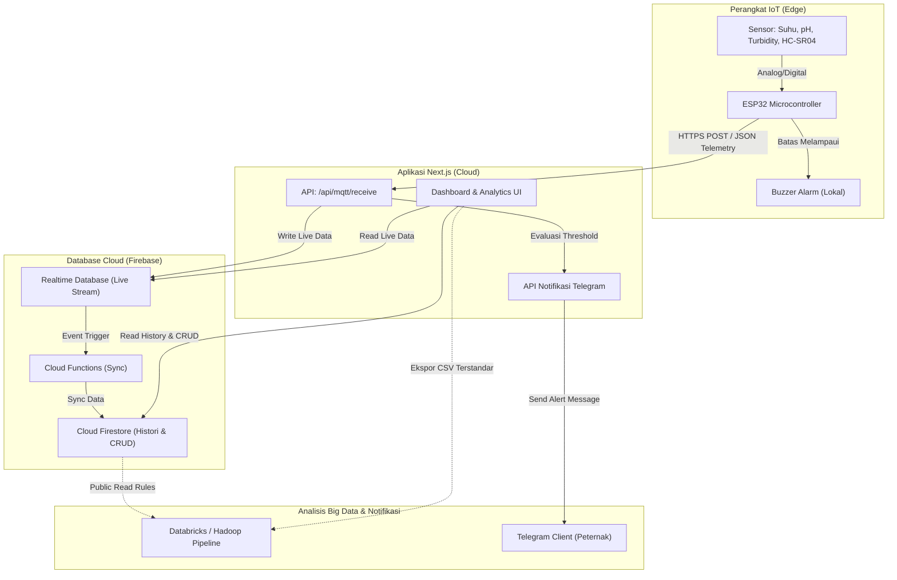

# 🌊 AquaVion - Platform Cerdas Monitoring Kolam Lele Berbasis IoT, Cloud, & Big Data

> **AquaVion** (diadaptasi dari *Aqua Nexa*) adalah sistem cerdas berbasis *Cyber-Physical System* (CPS) yang mengintegrasikan perangkat IoT, layanan Cloud Computing, dan analisis Big Data untuk memonitor parameter kualitas air kolam budidaya ikan lele secara real-time. Platform ini membantu peternak lele meminimalisir risiko kematian ikan akibat memburuknya kualitas air melalui deteksi dini, sistem pakar lokal/cloud, serta notifikasi otomatis.

---

## 🌟 Fitur Utama

AquaVion dikembangkan dengan pendekatan end-to-end yang tangguh:

1. **Dashboard Real-time & Interaktif**
   - Visualisasi tren parameter sensor menggunakan grafik dinamis berbasis **Recharts**.
   - Monitoring parameter kritis secara instan: **Suhu (°C)**, **pH Air**, **Kekeruhan (Turbidity)**, dan **Tinggi Air (cm)**.
   - Pemantauan status kolam: **"Aman"** (Hijau) atau **"Butuh Tindakan"** (Merah).

2. **Manajemen Multi-Kolam (CRUD)**
   - Mendukung penambahan banyak kolam dalam satu akun peternak.
   - Menghubungkan perangkat keras IoT ke masing-masing kolam menggunakan identitas unik `device_id`.
   - Konfigurasi dimensi kolam (luas permukaan dan kedalaman total) serta batas ambang (*threshold* kustom) suhu, pH, kekeruhan, dan tinggi air.

3. **Sistem Pakar Otomatis (Decision Support System)**
   - Menerjemahkan data mentah sensor ke tindakan mitigasi praktis.
   - Menghitung tinggi air aktual secara real-time (Kedalaman Kolam - Jarak Sensor) serta estimasi volume air aktual.
   - Logika penanganan otomatis (contoh: *Suhu Dingin → Tutup kolam atau gunakan pemanas*, *pH Asam → Tambahkan kapur pertanian*).

4. **Integrasi Notifikasi Multisaluran**
   - **Telegram Bot (@AquaVionBot)**: Pengiriman peringatan kritis secara instan ke ponsel peternak.
   - **Web Push Notification**: Notifikasi lokal di browser/perangkat mobile pengguna bahkan saat website sedang ditutup.
   - **Local Buzzer**: Alert suara langsung di area kolam jika parameter keluar dari ambang batas aman.

5. **Kesiapan Big Data & Analitik**
   - **Ekspor CSV Terstandarisasi**: Format ekspor historik yang ramah terhadap platform pengolah data besar (**Apache Spark**, **Databricks**, atau **Hadoop**) dengan timestamp standar ISO-8601.
   - **Firestore Read Path Open Access**: Aturan keamanan Firestore dirancang khusus untuk membiarkan pipeline Big Data luar menarik data telemetri historik secara efisien.

---

## 🏗️ Arsitektur Sistem & Aliran Data

Sistem ini didesain menggunakan arsitektur hybrid yang memadukan komputasi tepi (*edge computing*), database real-time untuk visualisasi instan, dan database dokumen untuk analitik jangka panjang.



### Penjelasan Aliran Data:
1. **IoT ke Next.js (Ingestion)**: ESP32 membaca data fisik kolam, mengevaluasi peringatan lokal (Buzzer), kemudian mengirimkan data JSON berformat HTTPS POST ke API Next.js `/api/mqtt/receive`.
2. **Next.js ke RTDB (Realtime Stream)**: API menerima request, mengevaluasi tindakan pakar, kemudian menyimpannya ke **Firebase Realtime Database (RTDB)** untuk disalurkan langsung ke Dashboard web peternak secara real-time.
3. **RTDB ke Firestore (Synchronization)**: **Firebase Cloud Functions** mendeteksi perubahan data baru di RTDB dan secara otomatis melakukan sinkronisasi data tersebut ke **Cloud Firestore** untuk penyimpanan permanen (histori).
4. **Firestore ke Big Data/Analytics (Outgestion)**: Data historik di Firestore siap digunakan oleh platform Big Data seperti **Databricks** melalui Firestore API dengan hak akses *read-only* publik khusus, atau diekspor secara manual oleh peternak via CSV.

---

## 🛠️ Spesifikasi Teknologi

### Aplikasi Web (Frontend & Backend API)
- **Framework**: [Next.js v16 (App Router)](https://nextjs.org/) & React 19
- **Styling**: [Tailwind CSS v4](https://tailwindcss.com/) & [Framer Motion](https://www.framer.com/motion/) untuk animasi mikro
- **Visualisasi**: [Recharts](https://recharts.org/) untuk visualisasi grafik historik
- **Ikon**: [Lucide React](https://lucide.dev/)
- **Layanan Cloud**: Firebase Suite (Authentication, Realtime Database, Cloud Firestore, Cloud Functions)
- **Komunikasi Notifikasi**: Telegram Bot API & Web Push Notification

### Perangkat IoT & Firmware
- **Mikrokontroler**: ESP32 DevKit V1
- **Sensor**:
  - Sensor Suhu: **DS18B20** (Waterproof probe)
  - Sensor Keasaman: **pH Meter Sensor Analog**
  - Sensor Kekeruhan: **Turbidity Sensor Analog**
  - Sensor Tinggi Air: **HC-SR04 Ultrasonic Sensor**
  - Aktuator Alert: **Active Buzzer 5V**
- **IDE Firmware**: [PlatformIO](https://platformio.org/) / VS Code
- **Bahasa**: C++ (Arduino Framework)

---

## 🚀 Cara Menjalankan Project secara Lokal

### 1. Prasyarat (Prerequisites)
Pastikan komputer Anda sudah terinstal **Node.js** (versi >= 18) dan **Git**.

### 2. Kloning Project & Pasang Dependensi
```bash
# Clone repository ini
git clone https://github.com/Naditya206/AquaVion.git
cd AquaVion

# Install library pendukung website
npm install
```

### 3. Konfigurasi Environment Variables (`.env.local`)
Buat file bernama `.env.local` di folder root project (atau sesuaikan dari file `.env` yang sudah ada):
```env
NEXT_PUBLIC_FIREBASE_API_KEY="AIzaSyAB7..."
NEXT_PUBLIC_FIREBASE_AUTH_DOMAIN="aquavion-26.firebaseapp.com"
NEXT_PUBLIC_FIREBASE_PROJECT_ID="aquavion-26"
NEXT_PUBLIC_FIREBASE_STORAGE_BUCKET="aquavion-26.firebasestorage.app"
NEXT_PUBLIC_FIREBASE_MESSAGING_SENDER_ID="591800636898"
NEXT_PUBLIC_FIREBASE_APP_ID="1:591800636898:web:2e39f37d95143bdcef15bb"

# Konfigurasi Server-Side
FIREBASE_API_KEY="AIzaSyAB7..."
FIREBASE_AUTH_DOMAIN="aquavion-26.firebaseapp.com"
FIREBASE_PROJECT_ID="aquavion-26"
FIREBASE_STORAGE_BUCKET="aquavion-26.firebasestorage.app"
FIREBASE_MESSAGING_SENDER_ID="591800636898"
FIREBASE_APP_ID="1:591800636898:web:2e39f37d95143bdcef15bb"
```

### 4. Jalankan Website di Mode Development
```bash
npm run dev
```
Buka browser Anda dan akses [http://localhost:3000](http://localhost:3000).

### 5. Deploy Firebase Security Rules (Jika Diperlukan)
Untuk menerapkan aturan keamanan data yang telah ditentukan di project:
```bash
# Pastikan Anda telah login ke Firebase CLI
firebase login

# Deploy konfigurasi rules
firebase deploy --only firestore:rules
firebase deploy --only database
```

---

## 📟 Dokumentasi Integrasi Perangkat IoT

### 1. Payload Data Telemetri (Format JSON)
Kirimkan payload HTTP POST ke endpoint `/api/mqtt/receive` dengan skema berikut:

```json
{
  "userId": "we2KX9B0sCRBwnaeB9kD9xrzvsf2",
  "device_id": "AQN-IOT-001",
  "temperature": 28.5,
  "ph": 7.2,
  "turbidity": 350,
  "waterLevel": 55.0,
  "ssid": "MyWiFiNetwork"
}
```

*Keterangan parameter:*
- `userId` (Wajib): ID akun Firebase milik Peternak lele.
- `device_id` (Wajib): ID unik perangkat IoT yang terdaftar pada kolam.
- `temperature`: Nilai suhu air (°C).
- `ph`: Tingkat keasaman air (skala 0 - 14).
- `turbidity`: Kekeruhan air dalam bentuk ADC/NTU.
- `waterLevel`: Tinggi air aktual yang dibaca oleh sensor (cm).
- `ssid`: Nama jaringan WiFi yang tersambung pada ESP32 (opsional, untuk indikator sinyal).

### 2. Panduan Pengunggahan Firmware ESP32
1. Buka folder `firmware/esp32` di VS Code yang telah memiliki ekstensi **PlatformIO**.
2. Buka berkas [config.h](file:///e:/whateverapp/laragon/www/College_Class/Semester_6/AquaVion/firmware/esp32/include/config.h) dan sesuaikan konfigurasi jaringan serta tujuan URL:
   - `WIFI_SSID`: SSID WiFi lokal Anda.
   - `WIFI_PASSWORD`: Sandi WiFi lokal Anda.
   - `API_URL`: Ganti dengan IP laptop Anda (misal `http://192.168.1.15:3000/api/mqtt/receive`) untuk pengetesan lokal atau domain Vercel Anda jika sudah dideploy.
   - `USER_ID`: Firebase UID Anda.
   - `DEVICE_ID`: Device ID yang Anda bind ke kolam.
3. Hubungkan board ESP32 ke laptop dan klik **Upload** di panel bawah PlatformIO.

---

## 📈 Standar Parameter Budidaya Lele (Ambang Batas)
Berikut adalah rentang kondisi optimal air kolam untuk pertumbuhan maksimal ikan lele (sebagaimana dipetakan dalam [Guidebook](file:///e:/whateverapp/laragon/www/College_Class/Semester_6/AquaVion/src/app/guidebook/page.tsx)):

| Parameter | Ambang Batas Minimum | Ambang Batas Maksimum | Tindakan Jika Di Luar Batas |
| :--- | :---: | :---: | :--- |
| **Suhu** | 25 °C | 30 °C | **Terlalu dingin**: pasang penutup kolam / heater.<br>**Terlalu panas**: berikan aerasi lebih atau tambahkan naungan. |
| **pH Air** | 6.5 | 8.5 | **Terlalu asam**: taburkan kapur dolomit/pertanian.<br>**Terlalu basa**: ganti sebagian air kolam / tambahkan daun ketapang. |
| **Kekeruhan** | - | 400 NTU | **Terlalu keruh**: kurangi intensitas pemberian pakan atau lakukan siphon (penyedotan kotoran dasar). |
| **Tinggi Air** | 40 cm | 70 cm | **Terlalu dangkal**: segera tambahkan air agar lele tidak stres akibat panas matahari.<br>**Terlalu dalam**: buang kelebihan air agar lele tidak kehabisan energi saat mengambil napas di permukaan. |

---

## 🤝 Aturan Kolaborasi Anggota Tim
Untuk kelancaran pengembangan bersama di Semester 6 ini, disarankan untuk mematuhi kesepakatan tim berikut:
1. **Branching Strategy**: Jangan langsung push ke branch `main`/`master`! Gunakan branch fitur terpisah (misalnya: `feat/dashboard-chart`, `fix/telegram-bot`) kemudian buat *Pull Request* (PR).
2. **Review & Approve**: Setiap perubahan kode harus ditinjau (di-review) oleh minimal satu anggota tim sebelum di-merge ke branch utama.
3. **CI/CD**: Direkomendasikan menggunakan pipeline integrasi berkelanjutan agar website ter-deploy secara otomatis ke Vercel saat PR sukses di-merge.
4. **Komunikasi Terbuka**: Perbanyak koordinasi di grup chat jika menemukan kendala. Kita semua dalam proses belajar, jangan takut salah! 💪
